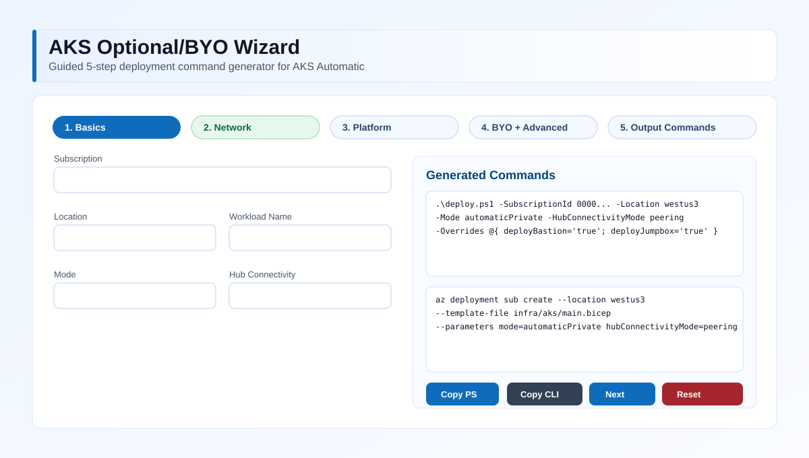

# AKS Automatic — progressive Bicep deployment

User-friendly, fully-parameterized deployment for **AKS Automatic** clusters
(with optional **managed system node pools (preview)**) using Bicep + a
staged PowerShell/Bash driver.

## Modes

| Mode | API server | VNet | Managed system node pools |
|---|---|---|---|
| `automaticManaged` *(default)* | Public (API server VNet integration) | AKS-managed | **Enabled** (`hostedSystemProfile`) |
| `automaticPrivate` | **Private** | Customer-supplied VNet + Private DNS zone | Disabled *(not supported in custom VNet — per Microsoft Learn)* |

> The script enforces this automatically — you cannot accidentally combine private + managed system node pools.

## Layout

```
.
├── azure.yaml                     # azd manifest — points azd at infra/aks
├── .github/workflows/lint.yml     # bicep build/lint + PSScriptAnalyzer + shellcheck
└── infra/aks/
    ├── main.bicep                     # subscription-scope orchestrator
    ├── main.bicepparam                # all parameters (override anything you want)
    ├── deploy.ps1                     # progressive driver (Windows / PS Core)
    ├── deploy.sh                      # progressive driver (Linux/macOS)
    ├── connect-aks.ps1                # post-deploy AKS connect helper (private/public)
    ├── deploy-wizard.ps1              # launches browser-based command wizard UI
    ├── wizard/
    │   ├── index.html                 # user-friendly deployment wizard
    │   ├── help.html                  # wizard option help page (opens in new tab)
    │   ├── favicon.svg                # wizard/favicon icon
    │   └── wizard-preview.svg         # wizard preview image used in README
    └── modules/
        ├── identity.bicep             # control-plane + kubelet UAMI
        ├── network.bicep              # VNet, AKS subnet, PE subnet, NSG
        ├── privateDns.bicep           # privatelink.<region>.azmk8s.io + VNet link
      ├── privateDnsLink.bicep       # additional VNet links (e.g., hub)
        ├── logAnalytics.bicep         # Container Insights workspace
        ├── monitoring.bicep           # Azure Monitor workspace + optional Grafana
        ├── acr.bicep                  # optional new ACR
      ├── hub.bicep                  # optional hub VNet + Bastion + jumpbox subnets
      ├── peering.bicep              # bidirectional VNet peering helper
      ├── bastion.bicep              # Bastion host
      ├── jumpbox.bicep              # Linux jumpbox VM
      ├── aksPrivateEndpoint.bicep   # AKS management PE (legacy private clusters)
        ├── roleAssignments.bicep      # kubelet MIO + ACR pull + app-routing DNS
        ├── roleAssignmentAcr.bicep
      ├── roleAssignmentAks.bicep
        ├── roleAssignmentDnsZone.bicep
        ├── roleAssignmentSubnet.bicep      # cross-sub safe Network Contributor on subnet
        ├── roleAssignmentPrivateDns.bicep  # cross-sub safe PDNS Zone Contributor
        ├── clusterAdmin.bicep         # Azure RBAC cluster admin/user roles
        ├── aks.bicep                  # the AKS Automatic cluster itself
        └── maintenance.bicep          # optional planned maintenance windows
```

## Quick start

You can drive the template three ways — pick whichever fits your workflow.

### Option A — `azd up` (Azure Developer CLI)

The repo root [azure.yaml](azure.yaml) wires `azd` to `infra/aks/main.bicep`.
The `bicepparam` reads `AZURE_ENV_NAME` / `AZURE_LOCATION` / `AKS_MODE` from
the environment, so `azd env set` flows through cleanly.

```powershell
azd auth login
azd env new aks-dev
azd env set AZURE_LOCATION westus3
azd env set AKS_MODE automaticManaged   # or automaticPrivate
azd up
```

The `preprovision` hook runs the same `deploy.ps1 -Stage Preflight` checks
(prereq install, login, RBAC, region, providers, feature flag). The
`postprovision` hook fetches credentials and runs `kubectl get nodes`
(skipped automatically for `automaticPrivate`).

### Option B — driver script (full control over staging)

```powershell
cd infra\aks
.\deploy.ps1 -SubscriptionId <sub-id> -Location westus3 -AutoName
```

```bash
cd infra/aks
./deploy.sh -s <sub-id> -l westus3 --auto-name
```

### Option B2 — deployment wizard UI (recommended for first-time users)

Launch the local browser wizard to walk through a 5-step flow and build correct
commands for `deploy.ps1` and for raw `az deployment` usage:

```powershell
cd infra\aks
.\deploy-wizard.ps1
```

Wizard preview:



The wizard helps with:

- Choosing mode (`automaticManaged` vs `automaticPrivate`)
- Hub connectivity (`none`, `peering`, `privateEndpoint`, `both`)
- Bastion + jumpbox toggles and SSH key path
- Generating copy-paste-ready `deploy.ps1` and `az deployment sub create` commands
- Highlighting validation warnings for incompatible combinations
- Preventing step progression until required fields are valid

### Option C — raw `az deployment` (CI-friendly)

```bash
az deployment sub create \
  --location westus3 \
  --template-file infra/aks/main.bicep \
  --parameters infra/aks/main.bicepparam
```

### Interactive (confirm every name)

```powershell
cd infra\aks
.\deploy.ps1 -SubscriptionId <sub-id> -Location eastus2 -Mode automaticPrivate -WorkloadName payments -Interactive
```

### Bring your own everything (no prompts, file-driven)

Edit [infra/aks/main.bicepparam](infra/aks/main.bicepparam) and run:

```powershell
cd infra\aks
.\deploy.ps1 -SubscriptionId <sub-id> -Location westus3
```

## Progressive / patchable

The driver runs four stages — each independently re-runnable:

| Stage | What it does |
|---|---|
| `Preflight` | PowerShell version, **auto-installs** Azure CLI (winget/apt/brew/dnf), Bicep, `aks-preview`, kubectl; `az login` if needed; caller RBAC sanity (Owner/Contributor/UAA); provider registrations; AKS region availability; `AKS-AutomaticHostedSystemProfilePreview` feature |
| `Plan` | `az deployment sub what-if` (skip with `-SkipWhatIf`) |
| `Deploy` | Submits `main.bicep` at subscription scope; prints operation failures on error |
| `Smoke` | Loads `outputs.json`, runs `az aks get-credentials` + `kubectl get nodes` (works standalone after a prior Deploy) |

Run a single stage:

```powershell
cd infra\aks
.\deploy.ps1 -Stage Deploy
.\deploy.ps1 -Stage Smoke
```

Resume after a failure (re-uses prior deployment name + name overrides):

```powershell
cd infra\aks
.\deploy.ps1 -Resume
```

Patch a single parameter without editing the file:

```powershell
cd infra\aks
.\deploy.ps1 -Resume -Overrides @{ enableManagedGrafana = 'true' }
```

## Hub connectivity modes

`hubConnectivityMode` options:

- `none`: no hub resources
- `peering`: peer hub and spoke VNets
- `privateEndpoint`: request AKS management private endpoint in hub
- `both`: peering + private endpoint request

Important AKS Automatic note:

- In `automaticPrivate`, AKS Automatic uses API server VNet integration.
- The AKS `management` private endpoint path is not supported in that model.
- The template now guards this path and skips PE when API server VNet integration is active.
- For AKS Automatic private, use hub peering + private DNS link as the supported pattern.

## Optional + BYO matrix

The template is designed so most components are optional and many can be
bring-your-own (BYO):

| Area | Optional? | BYO support | Key parameters |
|---|---|---|---|
| AKS cluster | No | No (cluster is the primary resource) | `clusterName`, `mode` |
| Log Analytics | Yes | Name-based reuse in same RG | `logAnalyticsWorkspaceName` (empty = skip) |
| Azure Monitor workspace | Yes | Name-based reuse in same RG | `azureMonitorWorkspaceName` (empty = skip) |
| Managed Grafana | Yes | Name-based reuse in same RG | `enableManagedGrafana`, `managedGrafanaName` |
| ACR | Yes | Yes (cross-sub/RG IDs) | `acrMode`, `acrName`, `existingAcrIds` |
| Spoke VNet/subnet | Yes (for private mode) | Yes | `byoVnetSubnetId`, `byoPodSubnetId` |
| Private DNS zone | Yes | Yes (cross-sub/RG ID) | `byoPrivateDnsZoneId` |
| Hub VNet | Yes | Yes | `hubConnectivityMode`, `byoHubVnetId` |
| Hub Bastion subnet | Yes | Yes | `byoHubBastionSubnetId` |
| Hub jumpbox subnet | Yes | Yes | `byoHubJumpboxSubnetId` |
| Hub PE subnet | Yes | Yes | `byoHubPeSubnetId` |
| Bastion | Yes | N/A (resource optional) | `deployBastion`, `bastionSku` |
| Jumpbox | Yes | N/A (resource optional) | `deployJumpbox`, `jumpboxSshPublicKey` |

Notes:

- BYO IDs can point to other subscriptions/resource groups as long as the
  deploying principal has required rights at those scopes.
- In `automaticPrivate`, if BYO hub VNet is used with Bastion/Jumpbox, provide
  BYO subnet IDs as well.
- AKS Automatic private mode still follows the API server VNet integration
  behavior described above.

## Wizard behavior

The wizard now generates overrides from explicit optional/BYO fields, so users
do not need to handcraft a large `-Overrides` block. A manual append box still
exists for advanced parameters not exposed in the UI.

The UI is organized as a guided 5-step workflow:

- Step 1: Basics (subscription, location, naming)
- Step 2: Optional platform features (ACR, monitoring)
- Step 3: Private network and BYO connectivity IDs
- Step 4: BYO IDs and advanced overrides
- Step 5: Generated commands and copy actions

Additional UX and accessibility behaviors:

- Inline field errors with invalid state indicators on required inputs
- Next button gating based on per-step validation
- Global Help button that opens a dedicated help page in a separate browser tab
- Keyboard navigation for wizard chips (Left/Right/Home/End, Enter/Space)
- Semantic step roles (`tablist`, `tab`, `tabpanel`) and live status regions
- Session restore for form values and current step via `localStorage`
- Copy actions show toast feedback for both PowerShell and Azure CLI command blocks

Accessibility note:

- The page was updated with Section 508-oriented semantic HTML and interaction patterns.
- This repository does not include a formal VPAT or third-party certification artifact.

### Troubleshooting wizard validation

- `Subscription ID is required`: provide a valid Azure subscription GUID in Step 1.
- `Location is required`: set an Azure region (for example `westus3`) in Step 1.
- `acrName is required when acrMode=new`: in Step 3, set ACR mode to `new` and provide an ACR name.
- `existingAcrIds is required when acrMode=existing`: in Step 3, provide one or more full ACR resource IDs.
- `Hub subnet IDs are required`: in Step 4, when using BYO hub VNet with Bastion/jumpbox enabled, set the related BYO subnet IDs.
- Step navigation remains disabled: check the inline error text under fields in the current step and resolve each required value.

Built-in one-click presets:

- `1) Minimum Cost`: managed mode, no hub, no Bastion/jumpbox, minimal add-ons.
- `2) Private Enterprise`: private mode, peering + Bastion + jumpbox, monitoring on, existing ACR flow.
- `3) BYO Everything`: private mode with BYO placeholders for spoke subnet, private DNS zone, hub VNet, and hub subnets.

These presets are starting points; every field remains editable after applying a preset.

## Bastion + jumpbox access

For native `az network bastion ssh` client access you need:

- Bastion Standard SKU
- `enableTunneling = true`
- Azure CLI extensions: `bastion` and `ssh`

If `az network bastion ssh` still fails locally, use tunnel mode (works reliably):

```powershell
$vmId = az vm show -g rg-ca -n vm-aks-ca-jb --query id -o tsv
az network bastion tunnel --name bas-aks-ca --resource-group rg-ca --target-resource-id $vmId --resource-port 22 --port 50022
```

Then in another shell:

```powershell
ssh -i infra/aks/.deploy/jumpbox_id_rsa -p 50022 azureuser@127.0.0.1
```

## Azure RBAC on cluster (kubectl authorization)

`kubectl` errors like `nodes is forbidden` indicate Azure RBAC role assignment issues,
not network reachability. For jumpbox managed identity access, assign at least:

- `Azure Kubernetes Service Cluster User Role`
- `Azure Kubernetes Service RBAC Cluster Admin` (or a narrower custom role as needed)

at the AKS cluster scope.

## Customization — every name is overridable

Any of these (in `main.bicepparam` or via `-Overrides` / `--set`):

- `resourceGroupName`, `nodeResourceGroupName`, `clusterName`, `dnsPrefix`, `fqdnSubdomain`
- `controlPlaneIdentityName`, `kubeletIdentityName`
- `vnetName`, `vnetAddressPrefixes`, `aksSubnetName`, `aksSubnetPrefix`,
  `privateEndpointSubnetName`, `privateEndpointSubnetPrefix`, `aksNsgName`
- `privateDnsZoneName`, `privateDnsVnetLinkName`
- `byoVnetSubnetId`, `byoPodSubnetId`, `byoPrivateDnsZoneId` *(bring-your-own existing resources)*
- `logAnalyticsWorkspaceName`, `azureMonitorWorkspaceName`, `managedGrafanaName`
- `acrMode` (`none` / `new` / `existing`), `acrName`, `existingAcrIds`, `acrSku`

## AKS knobs exposed

Networking, identity, security, observability, add-ons, mesh, storage CSI,
upgrades — every flag from `az aks create` that's relevant to Automatic is a
Bicep parameter:

- `kubernetesVersion`, `supportPlan` (incl. **AKSLongTermSupport**), `nodeResourceGroupRestrictionLevel`
- `apiServerAuthorizedIpRanges`, `enablePrivateCluster`, `privateDnsZone`, `disablePrivateClusterPublicFqdn`
- `disableLocalAccounts`, `enableAzureRbac`, `tenantId`, `clusterAdminGroupObjectIds`
- `enableWorkloadIdentity`, `enableOidcIssuer`, `enableImageCleaner`, `enableKeyvaultSecretsProvider`, `disableRunCommand`
- `enableDefender`, `enableAzurePolicy`, `diskEncryptionSetId`, `enableCostAnalysis`
- `enableAppRouting`, `appRoutingDnsZoneIds`, `appRoutingNginxDefault`
- `enableIstio`, `istioRevisions`, `enableAiToolchainOperator`
- `enableKeda`, `enableVpa`
- `enableDiskCsi`, `enableFileCsi`, `enableBlobCsi`, `enableSnapshotController`
- `networkPlugin`, `networkPluginMode`, `networkDataplane`, `networkPolicy`,
  `podCidr`, `serviceCidr`, `dnsServiceIp`, `outboundType`, `loadBalancerSku`
- `httpProxyConfig` *(object — supports trustedCa)*
- `systemPoolVmSize`, `systemPoolNodeCount`, `systemPoolOsSku`, `systemPoolZones`
- `autoUpgradeChannel`, `nodeOsUpgradeChannel`, `autoUpgradeMaintenanceWindow`, `nodeOsMaintenanceWindow`

## RBAC included

Created automatically and idempotently — **cross-subscription safe**: the VNet,
private DNS zone, and ACRs can live in completely different subscriptions from
the AKS cluster. Each role assignment is deployed to its target resource's own
sub + RG.

- **Control-plane MI** ← `Network Contributor` on the AKS subnet *(any sub/RG)*
- **Control-plane MI** ← `Private DNS Zone Contributor` on the private DNS zone *(any sub/RG)*
- **Control-plane MI** ← `Managed Identity Operator` on the kubelet MI
- **Control-plane MI** ← `DNS Zone Contributor` on each app-routing public DNS zone *(any sub/RG)*
- **Kubelet MI** ← `AcrPull` on each ACR (new or existing, **cross-sub/RG safe**)
- **Admin group** ← `Azure Kubernetes Service RBAC Cluster Admin` + `Azure Kubernetes Service Cluster User Role` on the cluster

> The deploying principal needs `Microsoft.Authorization/roleAssignments/write`
> (Owner or User Access Administrator) on the target RGs in any subscription
> referenced via `byoVnetSubnetId`, `byoPrivateDnsZoneId`, `existingAcrIds`,
> or `appRoutingDnsZoneIds`.

## Outputs

After a successful run, `infra/aks/.deploy/outputs.json` contains the cluster
FQDN (and private FQDN), OIDC issuer URL, kubelet client ID, node RG, and the
exact `az aks get-credentials` command.

## Connect to AKS after deployment

Yes. There are basic connection hints above (`Smoke` stage and `az aks get-credentials`).
Use the examples below for a full post-deploy workflow.

### Option 1: built-in smoke stage (fastest)

```powershell
cd infra\aks
.\deploy.ps1 -Stage Smoke
```

### Option 1b: dedicated connect helper (recommended)

This helper attempts direct local cluster access first, and for private clusters
falls back to Bastion + jumpbox if available.

```powershell
cd infra\aks
.\connect-aks.ps1
```

Force private fallback path explicitly:

```powershell
.\connect-aks.ps1 -UsePrivatePath
```

### Option 2: manual credentials from deployment outputs

```powershell
cd infra\aks
$out = Get-Content -Raw .\.deploy\outputs.json | ConvertFrom-Json
$rg = $out.resourceGroupName.value
$clusterId = $out.clusterId.value
$aksName = ($clusterId -split '/')[8]

az aks get-credentials -g $rg -n $aksName --overwrite-existing
kubectl config current-context
kubectl get nodes -o wide
```

Notes:

- For `automaticPrivate`, run these from a network path that can reach the private API server (for example, jumpbox/Bastion path).
- If `kubectl` returns forbidden errors, review the Azure RBAC section in this README.
- The helper expects jumpbox key path `.deploy\jumpbox_id_rsa` by default (when running from `infra\aks`); override with `-JumpboxSshKeyPath` if needed.

## Deploy an image to the new AKS environment

### Quick smoke app (public image)

```powershell
kubectl create namespace demo
kubectl create deployment hello --image=mcr.microsoft.com/azuredocs/aks-helloworld:v1 -n demo
kubectl expose deployment hello --port 80 --target-port 80 --type ClusterIP -n demo
kubectl get pods,svc -n demo
kubectl port-forward svc/hello 8080:80 -n demo
```

Then browse `http://127.0.0.1:8080`.

### ACR-backed image flow (recommended)

If you deployed with `acrMode=new`, an ACR was created in your environment. The cluster kubelet identity gets `AcrPull` via this template.

```powershell
cd infra\aks
$out = Get-Content -Raw .\.deploy\outputs.json | ConvertFrom-Json
$rg = $out.resourceGroupName.value
$clusterId = $out.clusterId.value
$aksName = ($clusterId -split '/')[8]

$acrName = az acr list -g $rg --query "[0].name" -o tsv
az acr import -n $acrName --source mcr.microsoft.com/azuredocs/aks-helloworld:v1 --image aks-helloworld:v1

$acrLoginServer = az acr show -n $acrName --query loginServer -o tsv
kubectl create deployment hello-acr --image "$acrLoginServer/aks-helloworld:v1" -n demo
kubectl rollout status deployment/hello-acr -n demo
kubectl get pods -n demo
```

Optional cleanup:

```powershell
kubectl delete namespace demo
```

## References

- [Overview of AKS Automatic with managed system node pools (preview)](https://learn.microsoft.com/en-us/azure/aks/automatic/aks-automatic-managed-system-node-pools-about)
- [Quickstart: Create an AKS Automatic cluster with managed system node pools](https://learn.microsoft.com/en-us/azure/aks/automatic/aks-automatic-managed-system-node-pools)
- [What is AKS Automatic?](https://learn.microsoft.com/en-us/azure/aks/intro-aks-automatic)
